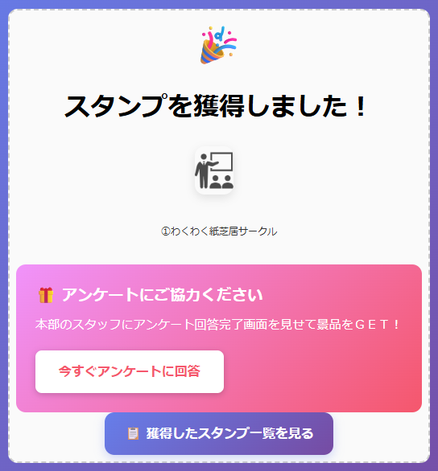
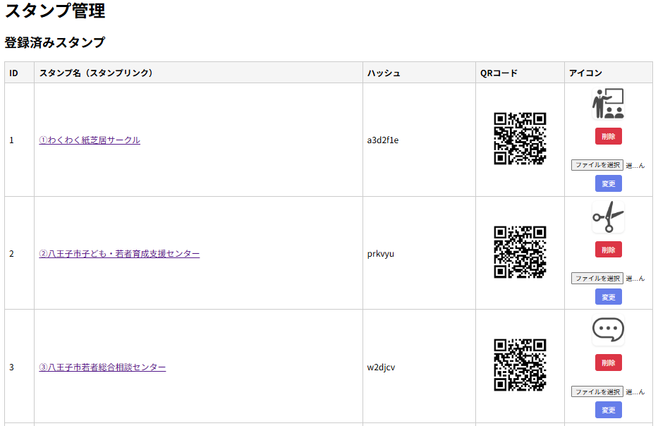
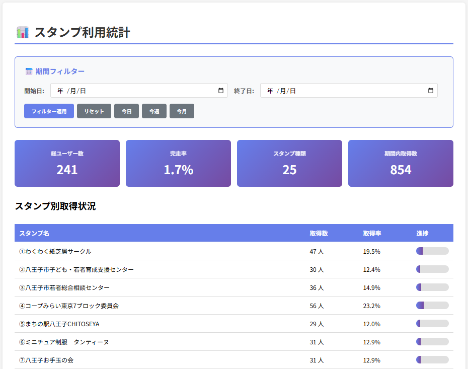

# QRコードを利用した、イベント向けWebスタンプラリーシステム

## 概要

本システムは、スマートフォンでQRコードを読み取ることでスタンプを取得し、Web上の「マイスタンプ帳」に自動反映されるイベント向けスタンプラリーシステムです。
アプリのインストール不要で、ブラウザのみで利用でき、短期間イベントや地域イベント、展示会、学校行事などでの利用を想定しています。

AWS（Lambda / API Gateway / S3）を用いたサーバレス構成により、低コストかつ高可用性を実現しています。
管理画面からスタンプ情報・QRコードの管理が可能で、柔軟な運用に対応できます。

### 主な特徴

- QRコード読み取りによるスタンプ取得
- Webブラウザのみで完結（アプリ不要）
- マイスタンプ帳表示（スマホ最適化）
- 管理画面によるスタンプ・QRコード管理
- AWSサーバレス構成による低コスト運用
- スタンプの統計表示

### 想定利用シーン

- 地域イベント
- 展示会・見本市
- 学校行事
- スタンプラリー型企画

### Tech Stack

- Node.js (Express)
- AWS Lambda
- API Gateway (REST API)
- Amazon S3
- EJS (View)
- QR Code generation

## 画面イメージ

### マイスタンプ帳


### スタンプ取得画面



### 管理画面



### 管理画面



---

## システム構成

本システムはAWSのサーバレス構成で動作します。

.
[User Browser]
↓
[API Gateway (REST)]
↓
[AWS Lambda (Express)]
↓
[Amazon S3]
├─ スタンプ設定ファイル
├─ ロゴ画像
└─ ユーザースタンプデータ

## ディレクトリ構成（概要）

.
├── src/
│ ├── index.js # メインアプリ
│ ├── routes/
│ │ └── admin.js # 管理画面ルーティング
│ ├── middleware/
│ └── views/ # EJSテンプレート
│
├── public/
│ └── css/
│ └── stamp.css # 共通スタイル
│
├── lambda.js # Lambdaエントリポイント
└── README.md

---

## 動作仕様（簡易）

### スタンプ取得の流れ

1. 管理画面で生成したQRコードを会場に設置
2. 参加者がQRコードを読み取り
3. Lambdaがスタンプを付与
4. S3にユーザー別スタンプ履歴を保存
5. マイスタンプ画面に即時反映

---

## 環境変数

Lambda 実行環境に以下の環境変数を設定してください。

| 変数名 | 内容 |
| --------- | ------ |
| STAMP_BUCKET | スタンプ設定・ロゴ・データ保存用S3バケット名 |
| ADMIN_USER | 管理画面ログインユーザー |
| ADMIN_PASS | 管理画面ログインパスワード |

---

## セットアップ手順（ローカル実行）
### リポジトリのクローン

```bash
git clone https://github.com/mitani-litus/onlinestamp.git
cd onlinestamp
```

### 依存パッケージのインストール

```bash
npm install
```

### 環境変数の設定

以下の環境変数を設定してください。

Linux / macOS (bash)

```bash
export STAMP_BUCKET=your-s3-bucket-name
export ADMIN_USER=admin
export ADMIN_PASS=password
export BASE_URL=http://localhost:3000
```

Windows (PowerShell)
```bash
setx STAMP_BUCKET your-s3-bucket-name
setx ADMIN_USER admin
setx ADMIN_PASS password
setx BASE_URL http://localhost:3000
```

### ローカル起動

```bash
npm start
```

起動後、ブラウザで以下にアクセスしてください。

ユーザー画面
http://localhost:3000/my-stamps

管理画面
http://localhost:3000/admin

## AWS デプロイ構成（概要）

本システムは以下の構成を想定しています。

```text
[ User Browser ]
        |
        v
[ API Gateway (REST) ]
        |
        v
[ AWS Lambda (Express) ]
        |
        v
[ Amazon S3 ]
   ├─ stamps/
   ├─ logos/
   └─ user-stamps/
```

### 必要なAWSリソース

S3 バケット（以下を保存）

stamp-names.json

ロゴ画像

### AWS構成とS3バケット構成

API Gateway（REST API）
Lambda 関数（Node.js 18以上）
S3 バケット構成
s3://your-bucket-name/
.
├── stamps/
│   └── stamp-names.json
├── logos/
│   └── stamp-1.png ...
└── user-stamps/
    └── {userId}.json

権限ポリシー（Lambda 実行ロール）

最低限、以下の権限が必要です。

```json
{
  "Effect": "Allow",
  "Action": [
    "s3:GetObject",
    "s3:PutObject"
  ],
  "Resource": "arn:aws:s3:::your-bucket-name/*"
}
```

Lambda 用デプロイ方法は Serverless Framework / SAM / CDK など、
任意の方式に対応可能です。

---

## 今後の拡張予定（構想）

- IoC / DI 導入による構造整理
- マルチイベント対応
- 管理画面UI改善
- 参加者ランキング表示
- SNS共有機能の追加

※ 現在は 実運用可能な最小構成（MVP）として構築 しています。

---

## ライセンス

MIT License

## クレジット

本リポジトリは、Code for Hachiojiによって作成され、管理しています。
https://code4hachioji.org
